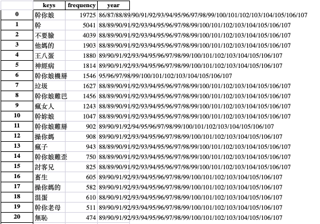
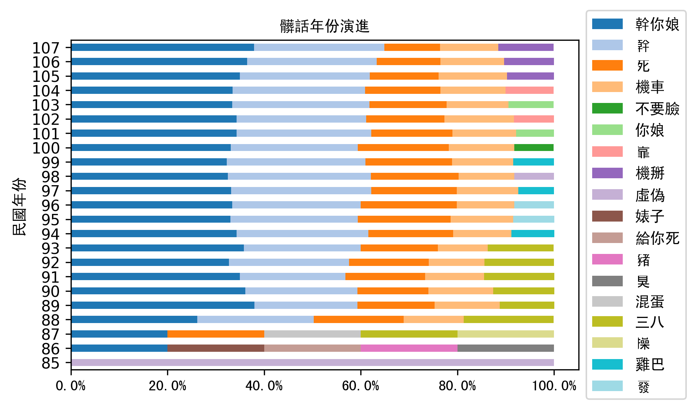
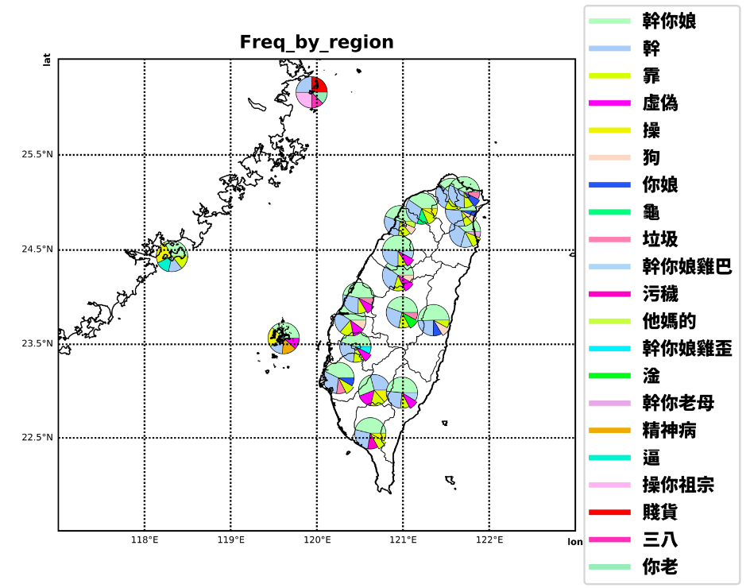
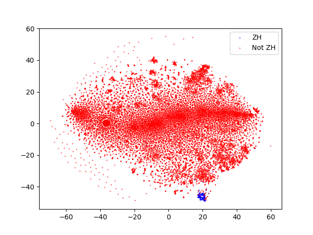

# HW 4, 5, 6

## 針對公然侮辱的法院判決書分析

這次的作業，我希望最後可以做出一個類似『公然侮辱辨識器』的classifier，資料的來源是以台灣各級法院的判決書為training data，資料來源可以直接從地檢署的網站載下來，我把載下來的檔案放在 [自己的google drive](https://drive.google.com/drive/folders/1ZUyzslITiVQj4ocJBBlzc8lrtGCf9YA3?usp=sharing)。以下是目前已經進行的分析和結果：

此次分析的目的：

- 了解data的性質。
- 確認應該以哪些資料作為classifier輸入與輸出。

而實際上我一開始預期的假設是：

1. 髒話（定義為所有被告案件裡的被告人激進詞語）應該是可以利用RNN與前後文篩出來的。

2. 是否為會被判刑、該被判多少也是可以用RNN與前後文的關係算出來的。

此次的文字分析希望能對以上兩個假設作出更多檢視。

但因為資料很雜很大，我寫的code也包含很多份檔案，所以我是重新整理過後放在現在的資料夾的，以下的介紹也只會標明code位置，以及描述一下作法。

### Preprossesing

#### cleaning json

因為一開始有的是json檔，大概有45000篇。而且載下來的判決書包含了各種罪名，所以實際上我用了python的json套件來過濾出實際有“公然侮辱”關鍵字的判決書。基本上就是將，"JFULL"的內容抽出來寫成檔案，再標上"JYEAR"和"JTITLE"。 這部分的code我放在`preprossessing/json_to_txt/read.py`。

最後的檔案list是：

```
CHDM,100,交簡,1522,20111006,1.json
CHDM,100,交簡,1570,20110729,1.json
CHDM,100,易,1001,20111219,1.json
CHDM,100,易,1048,20111212,1.json
CHDM,100,易,1111,20111230,1.json
CHDM,100,易,1132,20120403,1.json
CHDM,100,易,1133,20121207,2.json
CHDM,100,易,1137,20120329,1.json
CHDM,100,易,1156,20111115,1.json
CHDM,100,易,1157,20111208,1.json
CHDM,100,易,1177,20111130,1.json
CHDM,100,易,1198,20111230,1.json
CHDM,100,易,12,20110531,1.json
CHDM,100,易,1226,20111230,1.json
CHDM,100,易,1257,20111215,1.json
CHDM,100,易,1272,20111221,1.json
CHDM,100,易,1275,20120320,1.json
...
```

放在`namelist`裡面。

#### txt to python dictionary

接著為了方便分析，並抽出髒話的部分，我一開始是用很naive的方式，將被判決書裡面大小括號包起來的部分抽出來，並跟系上學長要了一張斷詞表放在`preprossessing/stops.txt`。

```
啊
阿
哎
哎呀
哎喲
唉
我
我們
按
按照
依照
吧
吧噠
把
罷了
被
本
本著
比
比方
比如
鄙人
彼
彼此
邊
別
別的
別說
並
並且
不比
不成
不單
...
```

濾出髒話的方法：基本上就是把括號裡，有很多斷詞那些濾掉，因為極有可能只是強調過後的一般對話，以最後剩下來的部分最為我清完後的髒話，結果來蠻接近的：

```
你一點法律常識也沒有
一個人不要臉到家了厚
對於證據調查無意見
內功好專吹喇叭為生
我就要整死妳弄死妳
你是在哭爸還是哭子
沒看過這麼垃圾的
你爸現在就要揍你
要讓你死得很難看
騙學生的社大講師
要給你死的很難看
交友複雜裝乖扯謊
沒大腦的男人姚崇
我拿刀殺你又怎樣
垃圾人還懂得法律
大家都說你是惡霸
警察有什麼了不起
要叫人把你處理掉
你們出去卡小心欸
吃砂石長大的縣長
你們班導是臭雞賣
你為何不去看醫生
你站著我開車撞你
走狗來了帶回去啦
妳惹到我妳就慘了
看大同街的肖賊仔
欺負攤販善良百姓
你他媽什麼東西啊
這種人會有醫德嗎
...
```

### Visualization

- 髒話字典

接下來，我根據已經濾出來的髒話回去跟每年的判決書比對，整理出一份包含頻率與年份的xlsx檔。實際上的實作方法，是分別先將每一年比對到的髒話建成dictionary，並存成根據年份的npy檔(放在`freq_by_year/zh2year/`裡面)，然後去計算頻率，最後的xlsx如下：

`new_ZH/new_HU_dictionary.xlsx`（部分截圖）



- 之後也根據髒話字典與年份畫出長條圖：



- 也有用類似的方式，畫出根據地域的髒話圓餅圖：



從visualization的部分，我們可以發現，**即使是同樣的髒話也會大量出現在不同的判決書裡面，而且常見的、頻率高的被告案件，通常都是長度極短的髒話。但在出面這麼多次的『O你娘』也不是每次都被判有罪。所以實際上應該無法只從單純人們講的激進詞語來判斷是否有罪**。

## Word Embedding

Word Embedding的地方我是用的主要套件是`gensim`裡面的`word2vec`，主要的code放在`word_embedding/src`裡，實際上train的過程我train了兩次，用的語料的部分是從wiki拿到的corpus（這樣可以避免判決書有特定的前後文架構來影響文字向量的計算），結果與語料都放在`word_embedding/similarity`裡。

斷詞的方法一樣是用`jieba`，並且也有採用上面提到的斷詞表。

以下是部分『三小』與其他前後文的共然率與similarity:

```
三小: 你娘: 0.7138674855232239, 推三小: 0.6880831718444824, 看三小: 0.6627681255340576, 洨: 0.6398653984069824, 我操: 0.6387801170349121, 卡好: 0.6359814405441284, 他媽的: 0.6333191394805908, 幹幹: 0.6330029964447021, 幹娘: 0.6324660181999207, 俗辣: 0.627269983291626, ..
```

之後，再降維畫圖，畫圖用的檔案是`word_embedding/Word_Embedding.py`。

這裡我降維的方法是用tsne，而不是pca，主要原因有兩個：

1. tsne比較可以保存各個維度之間的關係，可以保留比較多的feature。
2. tsne對於降維後因為如上的原因，可以顯示出更多小的clustering。

最後畫出的圖如下（ZH代表髒話）：



可以發現大部分的髒話，在語言裡面實際上是真的屬於某個特定的cluster，這代表maybe是否為髒話是可以

train的。

這裡我的結論是，**對於大部分的髒話，根據前後文，理論上應該是可以用ML、DL等hyper-dimentional的運算方式classified出來的。**

### 結論

從以上的初步分析，我們有得到了不同的結論：

1. 實際上應該無法只從單純人們講的激進詞語來判斷是否有罪。
2. 大部分的髒話（激進詞語），根據前後文，理論上應該是可以用ML、DL等hyper-dimentional的運算方式classified出來的。

因此，判斷是否觸犯公然侮辱的部分，可以還需要做被告人講髒話情境的文意分析，這相對來講會比較難。

但如果只是單純判斷是否為髒話，我們可以試著用RNN的model來做做看（請參閱extra），我也實際上有動手疊了ㄧ個attention-based的RNN model，但來沒有一個好的結果。

### Extra

我所用的attentions model其實是從之前做過的其他project的code拿過來改的。

code我都放在`Attn/`裡面：

```
Attn
├── main.py
├── namelist
├── src
│   ├── evaluate.py
│   ├── load.py
│   ├── model.py
│   └── train.py
├── stops.txt
└── tutorial.sh
```


實際上要run只需要跑`main.py`，encoder 和 decoder還有model的主要架構都放在`model.py`裡面，主要是用夾過權重的gru下去做的。

但目前改的過程有點bug，不然就是accurracy太低，因此可能要之後再改進。
